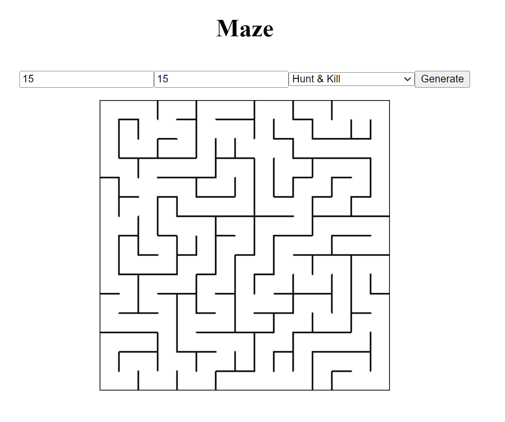

# MazeGame

A project to demonstrate how to generate mazes with two different algorithms:[ Recursive Backtracking](https://weblog.jamisbuck.org/2010/12/27/maze-generation-recursive-backtracking) and [Hunt & Kill](https://weblog.jamisbuck.org/2011/1/24/maze-generation-hunt-and-kill-algorithm). The app is implemented in Angular and TypeScript, the rendering is achieved with an HTML canvas element.

## Preview



## Build requirements

It's necessary to install [Node.js](https://nodejs.org/en/) to run the following build commands:

### Install dependencies

```
npm install
```

### Run live server

```
npm start
```

The app will be available under this address in the web browser: http://localhost:4200
